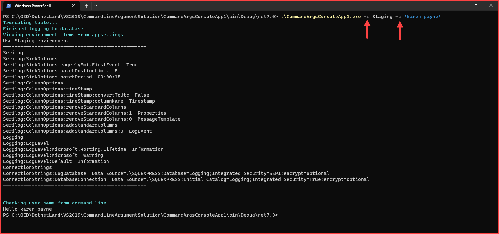

# About

This code sample demonstrates

- Passing an command parameter for a user name
- Uses `IConfigurationRoot` code to read from an `appsettings.json` dependent on a command line parameter for the environment, Development, Staging, Production.

Note for `-u` we must use <kbd>"</kbd>'s for more than one string.

