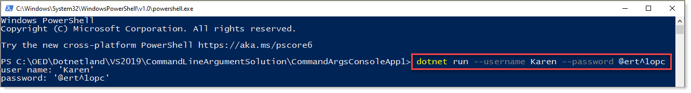

# About

Simple example for using `Microsoft.Extensions.Configuration.CommandLine`

In this example there is a Dictionary defining acceptable argument with short and long (alias) names.

```csharp
var switchMappings = new Dictionary<string, string>()
{
    { "-username", "username" },
    { "--username", "username" },
    { "-password", "password" },
    { "--password", "password" }
};
var builder = new ConfigurationBuilder();
builder.AddCommandLine(args, switchMappings);

var config = builder.Build();
```

Try it out via PowerShell

```
dotnet run --username Karen --password @ert^1opc
```
Note that in ASP.NET Core you can set the environment e.g.

```
dotnet run --environment "Staging"
```


