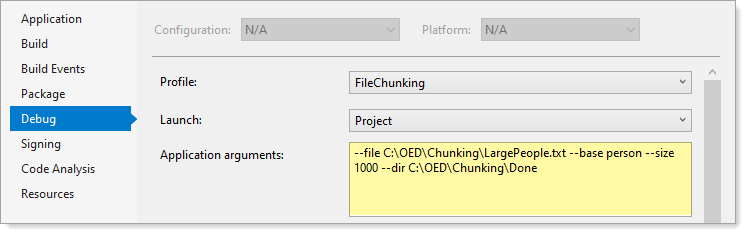

# About

This code sample takes a large file and chunks into smaller files.


In the example below, `--file` points to a large file, `--base` becomes the base name for each chunked file ending with a numeric value, `--size` indicates how many lines to chunk a file and the argument `-–dir` points to the location where chunk files reside.



```
--file C:\OED\Chunking\LargePeople.txt --base person --size 1000 --dir C:\OED\Chunking\Done
```

# Arguments

| Argument  | Description  | Required |
|:--------- |:-------------| :-------------: |
| --file   | which is a large file to split into chunks | &check; |
| --size    | how many lines per file | &check; |
| --base    | base name of chunked files | &check; |
| --dir     | location where to place chunked files  | &check; |

