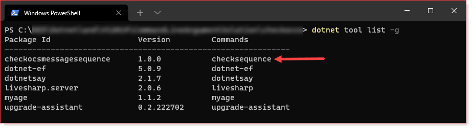

# About

Must run the following prior to installing in the project folder

```
dotnet new tool-manifest
```

# Important

This tool ask for user name and password but are not used, why, because there is no reason to as this tool is mine :-) But it would take little effort to remedy this.


**Run**

```
checksequence -u -p
```

**-u** (or `--userid`) is user id and **-p** (or `--password`) is password for development database.

**Note** Command name differs from assembly name which is done in the project file

```xml
<ToolCommandName>checksequence</ToolCommandName>
```

Next two commands are to work without publishing to NuGet,

**Install**

```
dotnet tool install --global --add-source ./nupkg checkocsmessagesequence
```

**Uninstall**

```
dotnet tool uninstall checkocsmessagesequence -g
```

# More

List locally installed tools

```
dotnet tool list -g
```

