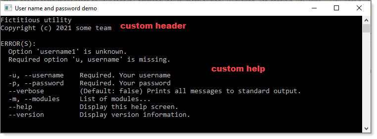
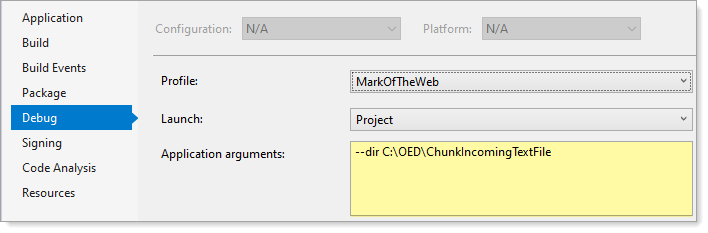

# C# Parsing command line arguments

Learn how to work with arguments passed to an application using [CommandLineParser](https://github.com/commandlineparser/commandline) via NuGet [package](https://www.nuget.org/packages/CommandLineParser/2.8.0).

There are plenty of code samples on the web that show how to use this library but none have complete working code while this repository has several code samples to make it easy to learn.

Included in this repository are console, dotnet tool and windows form projects using CommandLineParser library.

Note myage is a simply examples which accepts two dates and calcutates a person's age using the same code pattern used in the plain old console code samples.

## Points of interest

- Completely OOP centric code, not procedural, clean and easy to read
- How to create custom header, see `figure 1`
- How to setup custom help, see `figure 1`
- `Debug.WriteLine` is used in many places in code, this allows the person running code to easily see what is happening to learn from. For usage in a real application use `Console.WriteLine`.
- Use PowerShell to run examples e.g. `dotnet run` followed by arguments.



## Description of library

The Command Line Parser Library offers CLR applications a clean and concise API for manipulating command line arguments and related tasks, such as defining switches, options and verb commands. It allows you to display a help screen with a high degree of customization and a simple way to report syntax errors to the end user.

# Documentation

- [Wiki](https://github.com/commandlineparser/commandline/wiki)
- [At a glance](https://github.com/commandlineparser/commandline#at-a-glance)


# Included projects

To demonstrate various features there are two projects, `PromptForUserNamePassword` and `ArgumentWithMultipleValues` and one functional project, `MarkOfWeb`.

## How to learn

The best way for novice developers to learn how to work with this library is to set a breakpoint at the first line of code, step through unit the end of the program.

Each project has application arguments set to easily try out. Before running, check what the arguments are as you may need to change them. For instance, in the MarkOfTheWeb project we have a folder that surely does not exists on your computer so change it.



In some cases arguments are short version, others long version and some mixed.

For instance, `-u` (short) or `--username` (long)

```csharp
using CommandLine;

namespace PromptForUserNamePassword.Classes
{
    public sealed class CommandLineOptions
    {
        [Option('u', "username", Required = true, HelpText = "Your username")]
        public string Username { get; set; }
    }
}
```

For experienced developers, examine the code, run and adapt to your applications.

# Dotnet global tools

If working with  .NET Core 2.1 SDK and later versions you can use the command line parser to parse command line arguments also. If unfamilar with these tools see [the following](https://docs.microsoft.com/en-us/dotnet/core/tools/global-tools-how-to-create).

Example using [CommandLineParser](https://github.com/commandlineparser/commandline) is [dotnet-cleanup](https://github.com/sebnilsson/DotnetCleanup) and [quickup](https://github.com/Sergio0694/quickup).

# Copy rights

There are several places in code that have a copy right, these are to show how to display a copy right and are to be considered just that. There are no copyrights on code provided.